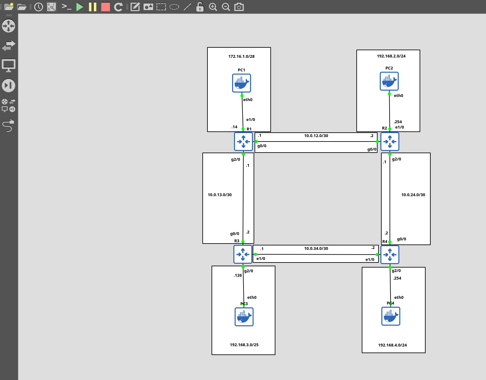
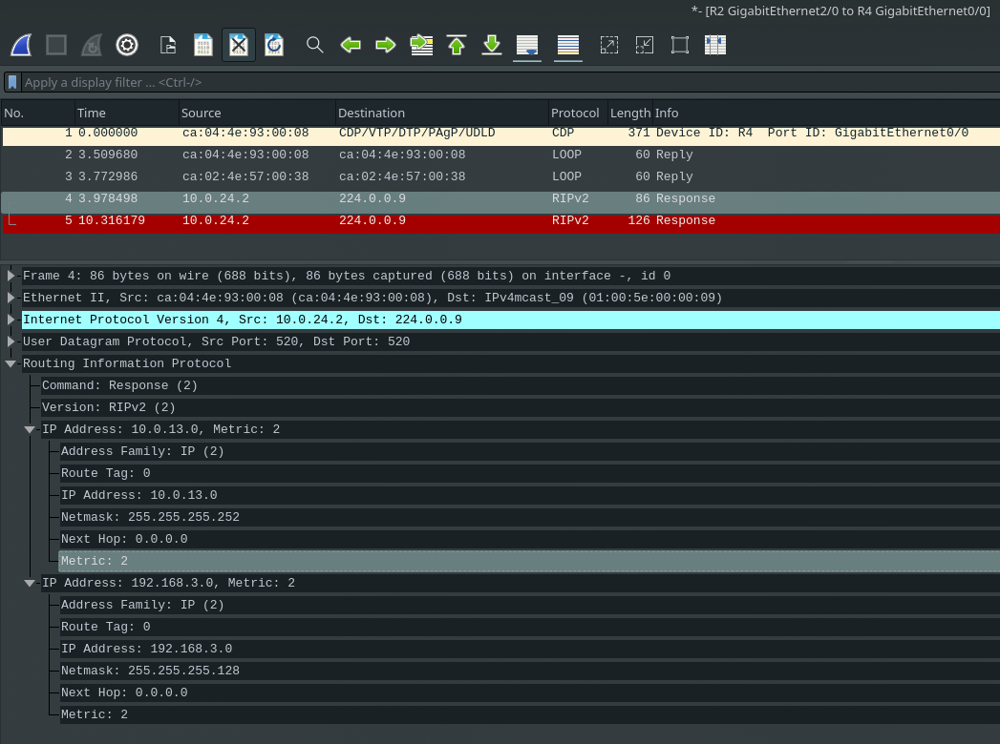

# Network Routing Protocols: RIP

This repository provides a practical demonstration of the **Routing Information Protocol (RIP)** using Cisco routers and Debian-based end hosts in a GNS3 lab environment.

---

## Table of Contents

* [1. Routing Information Protocol (RIP) Overview](#1-routing-information-protocol-rip-overview)

  * [Key Characteristics](#key-characteristics)
* [2. RIPv1 vs RIPv2](#2-ripv1-vs-ripv2)
* [3. Basic RIP Commands](#3-basic-rip-commands)
* [4. Practice](#4-practice)
  * [Setup](#setup)
  * [Dockerfile for Hosts](#dockerfile-for-hosts)
* [5. Interface IP Assignments](#5-interface-ip-assignments)
* [6. Configuring RIP](#6-configuring-rip)
* [7. Verifying RIP](#7-verifying-rip)
* [8. Optional Improvements](#8-optional-improvements)
* [9. Summary](#9-summary)

---

## 1. Routing Information Protocol (RIP) Overview

RIP is a **distance-vector Interior Gateway Protocol (IGP)** that uses "routing by rumor" to exchange routes.

### Key Characteristics

* **Metric**: Hop count (bandwidth is ignored)
* **Hop Limit**: Maximum of 15 hops (16 = unreachable)
* **Versions**:

  * **RIPv1** – IPv4, classful
  * **RIPv2** – IPv4, supports VLSM and CIDR
  * **RIPng** – IPv6
* **Message Types**:

  * **Request** – Ask neighbors for their routing table
  * **Response** – Send local routing table to neighbors
* **Update Frequency**: Every 30 seconds

---

## 2. RIPv1 vs RIPv2

| Feature             | RIPv1                       | RIPv2                 |
| ------------------- | --------------------------- | --------------------- |
| Address Advertising | Classful only (A, B, C)     | Supports VLSM & CIDR  |
| Subnet Mask         | Not included in updates     | Included in updates   |
| Message Delivery    | Broadcast (255.255.255.255) | Multicast (224.0.0.9) |

---

## 3. Basic RIP Commands

### Enabling RIP and Version Selection

```shell
R1(config)# router rip
R1(config-router)# version 2
```
- no auto-summary command
```shell
R1(config-router)#no auto-summary 
```
The no auto-summary command in Cisco routing protocols like EIGRP and RIP disables automatic 
summarization of subnet routes to their classful network boundary. By default, 
these protocols summarize routes at the boundary of major networks, but this behavior can be disabled using no auto-summary. 

- network command
```shell
R1(config-router)# network 10.0.0.0
```
This command identifies interfaces within the specified range, activates RIP on them,
forms adjacencies, and advertises the interface's network prefix.
- passive-interface command
```shell
R1(config-router)# passive-interface g2/0
```
This command stops RIP advertisements on a specified interface while
still allowing the network prefix of that interface to be advertised
to other RIP neighbors. It's recommended for interfaces without RIP neighbors.
- default-information originate command
```shell
R1(config-router)# default-information originate
```
Used to advertise a default gateway to RIP neighbors.


## 4. Practice
This lab utilizes the GNS3 network simulator with
Cisco 7200 routers and debian-based Docker containers as end hosts.
The topology uses:

* **Routers**: Cisco 7200 (GNS3)
* **End Hosts**: Debian-based Docker containers



You may use a python script to automate IP addresses assignment to save some time.

### Setup

```shell
python3 -m venv venv
source venv/bin/activate
pip install -r requirements.txt

# Verify port configuration matches your GNS3 setup
python3 routers.py
```

### Dockerfile for Hosts

```dockerfile
FROM gns3/ipterm
RUN apt-get update && \
    apt-get install -y iptables iproute2 net-tools iputils-ping nmap hping3 conntrack && \
    apt-get clean
```
After running the script, configured 
interfaces and default routes will be visible on routers and PCs.
---

## 5. Interface IP Assignments

### Routers interfaces config

```shell
R1#show ip int br
Interface                  IP-Address      OK? Method Status                Protocol
Ethernet0/0                unassigned      YES NVRAM  administratively down down    
GigabitEthernet0/0         10.0.12.1       YES NVRAM  up                    up      
Ethernet1/0                172.16.1.14     YES NVRAM  up                    up      
Ethernet1/1                unassigned      YES NVRAM  administratively down down    
Ethernet1/2                unassigned      YES NVRAM  administratively down down    
Ethernet1/3                unassigned      YES NVRAM  administratively down down    
GigabitEthernet2/0         10.0.13.1       YES NVRAM  up                    up      
GigabitEthernet3/0         unassigned      YES NVRAM  administratively down down    
```


```shell
R2#show ip int br
Interface                  IP-Address      OK? Method Status                Protocol
Ethernet0/0                unassigned      YES NVRAM  administratively down down    
GigabitEthernet0/0         10.0.12.2       YES NVRAM  up                    up      
Ethernet1/0                192.168.2.254   YES NVRAM  up                    up      
Ethernet1/1                unassigned      YES NVRAM  administratively down down    
Ethernet1/2                unassigned      YES NVRAM  administratively down down    
Ethernet1/3                unassigned      YES NVRAM  administratively down down    
GigabitEthernet2/0         10.0.24.1       YES NVRAM  up                    up      
GigabitEthernet3/0         unassigned      YES NVRAM  administratively down down    
R2#
```

```shell
R3#show ip int br
Interface                  IP-Address      OK? Method Status                Protocol
Ethernet0/0                unassigned      YES NVRAM  administratively down down    
GigabitEthernet0/0         10.0.13.2       YES NVRAM  up                    up      
Ethernet1/0                10.0.34.1       YES NVRAM  up                    up      
Ethernet1/1                unassigned      YES NVRAM  administratively down down    
Ethernet1/2                unassigned      YES NVRAM  administratively down down    
Ethernet1/3                unassigned      YES NVRAM  administratively down down    
GigabitEthernet2/0         192.168.3.126   YES NVRAM  up                    up      
GigabitEthernet3/0         unassigned      YES NVRAM  administratively down down
```

```shell
R4#show ip int br
Interface                  IP-Address      OK? Method Status                Protocol
Ethernet0/0                unassigned      YES NVRAM  administratively down down    
GigabitEthernet0/0         10.0.24.2       YES NVRAM  up                    up      
Ethernet1/0                10.0.34.2       YES NVRAM  up                    up      
Ethernet1/1                unassigned      YES NVRAM  administratively down down    
Ethernet1/2                unassigned      YES NVRAM  administratively down down    
Ethernet1/3                unassigned      YES NVRAM  administratively down down    
GigabitEthernet2/0         192.168.4.254   YES NVRAM  up                    up      
GigabitEthernet3/0         unassigned      YES NVRAM  administratively down down   
```

### PCs config
```shell
root@PC1:~# ip -br a && ip r
lo               UNKNOWN        127.0.0.1/8 ::1/128 
eth0             UNKNOWN        172.16.1.1/28 fe80::42:75ff:fe26:bc00/64 
default via 172.16.1.14 dev eth0 
172.16.1.0/28 dev eth0 proto kernel scope link src 172.16.1.1 

root@PC2:~# ip -br a && ip r
lo               UNKNOWN        127.0.0.1/8 ::1/128 
eth0             UNKNOWN        192.168.3.1/25 fe80::42:93ff:fea8:d400/64 
default via 192.168.3.126 dev eth0 
192.168.3.0/25 dev eth0 proto kernel scope link src 192.168.3.1 

root@PC3:~# ip -br a && ip r
lo               UNKNOWN        127.0.0.1/8 ::1/128 
eth0             UNKNOWN        192.168.2.1/24 fe80::42:61ff:fe15:e400/64 
default via 192.168.2.254 dev eth0 
192.168.2.0/24 dev eth0 proto kernel scope link src 192.168.2.1 

root@PC4:~# ip -br a && ip r
lo               UNKNOWN        127.0.0.1/8 ::1/128 
eth0             UNKNOWN        192.168.4.1/24 fe80::42:94ff:fe46:7800/64 
default via 192.168.4.254 dev eth0 
192.168.4.0/24 dev eth0 proto kernel scope link src 192.168.4.1 
```

---

## 6. Configuring RIP

### Example – Router 1

```shell
R1(config)#router rip
R1(config-router)#version 2
R1(config-router)#no auto-summary
R1(config-router)#network 10.0.0.0
R1(config-router)#network 172.16.0.0
R1(config-router)#passive-interface e1/0
```

*(Repeat with appropriate networks on R2–R4)*

---

## 7. Verifying RIP

### RIP Traffic Capture

RIP advertisements visible in Wireshark:


### Routing Table R2

```shell
R2(config)#do show ip route
Codes: L - local, C - connected, S - static, R - RIP, M - mobile, B - BGP
       D - EIGRP, EX - EIGRP external, O - OSPF, IA - OSPF inter area 
       N1 - OSPF NSSA external type 1, N2 - OSPF NSSA external type 2
       E1 - OSPF external type 1, E2 - OSPF external type 2
       i - IS-IS, su - IS-IS summary, L1 - IS-IS level-1, L2 - IS-IS level-2
       ia - IS-IS inter area, * - candidate default, U - per-user static route
       o - ODR, P - periodic downloaded static route, H - NHRP, l - LISP
       a - application route
       + - replicated route, % - next hop override

Gateway of last resort is not set

      10.0.0.0/8 is variably subnetted, 6 subnets, 2 masks
C        10.0.12.0/30 is directly connected, GigabitEthernet0/0
L        10.0.12.2/32 is directly connected, GigabitEthernet0/0
R        10.0.13.0/30 [120/1] via 10.0.12.1, 00:00:02, GigabitEthernet0/0
C        10.0.24.0/30 is directly connected, GigabitEthernet2/0
L        10.0.24.1/32 is directly connected, GigabitEthernet2/0
R        10.0.34.0/30 [120/1] via 10.0.24.2, 00:00:26, GigabitEthernet2/0
      172.16.0.0/28 is subnetted, 1 subnets
R        172.16.1.0 [120/1] via 10.0.12.1, 00:00:02, GigabitEthernet0/0
      192.168.2.0/24 is variably subnetted, 2 subnets, 2 masks
C        192.168.2.0/24 is directly connected, Ethernet1/0
L        192.168.2.254/32 is directly connected, Ethernet1/0
      192.168.3.0/25 is subnetted, 1 subnets
R        192.168.3.0 [120/2] via 10.0.24.2, 00:00:26, GigabitEthernet2/0
                     [120/2] via 10.0.12.1, 00:00:02, GigabitEthernet0/0
R     192.168.4.0/24 [120/1] via 10.0.24.2, 00:00:26, GigabitEthernet2/0
```
The router has added neighbors routes via RIP (R)

### Protocol Details

```shell
R2(config)#do show ip protocol
*** output cut ***

Routing Protocol is "rip"
  Outgoing update filter list for all interfaces is not set
  Incoming update filter list for all interfaces is not set
  Sending updates every 30 seconds, next due in 28 seconds
  Invalid after 180 seconds, hold down 180, flushed after 240
  Redistributing: rip
  Default version control: send version 2, receive version 2
    Interface             Send  Recv  Triggered RIP  Key-chain
    GigabitEthernet0/0    2     2                                    
    GigabitEthernet2/0    2     2                                    
  Automatic network summarization is not in effect <- due to "no auto-summary"
  Maximum path: 4
  Routing for Networks:
    10.0.0.0
    192.168.2.0
  Passive Interface(s):
    Ethernet1/0
  Routing Information Sources:
    Gateway         Distance      Last Update
    10.0.12.1            120      00:00:13
    10.0.24.2            120      00:00:08
  Distance: (default is 120)
```

---

## 8. Optional Improvements

### Set and Advertise Default Gateway

```shell
R1(config-router)#default-information originate
```

---

## 9. Summary

This lab demonstrates:

* RIP configuration (RIPv2) on Cisco routers
* Automatic IP assignment with Python
* Route propagation verification via Wireshark and CLI commands
